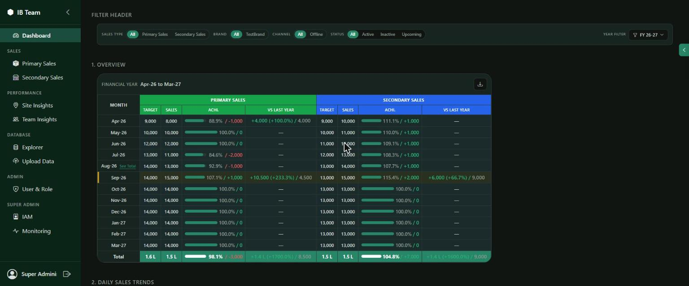
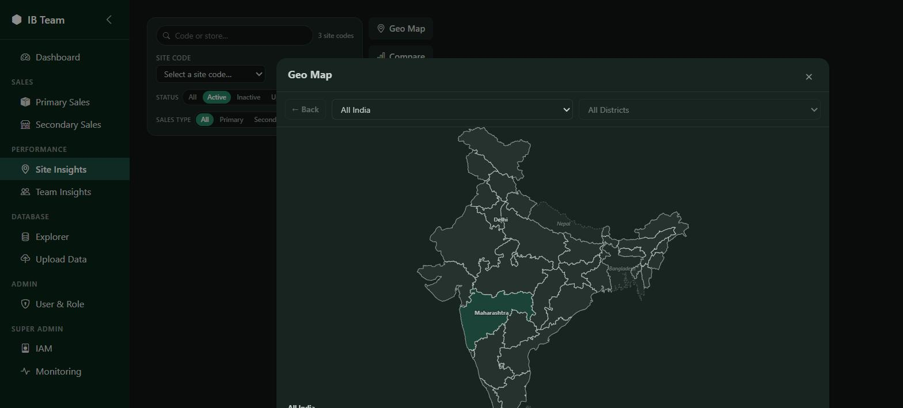
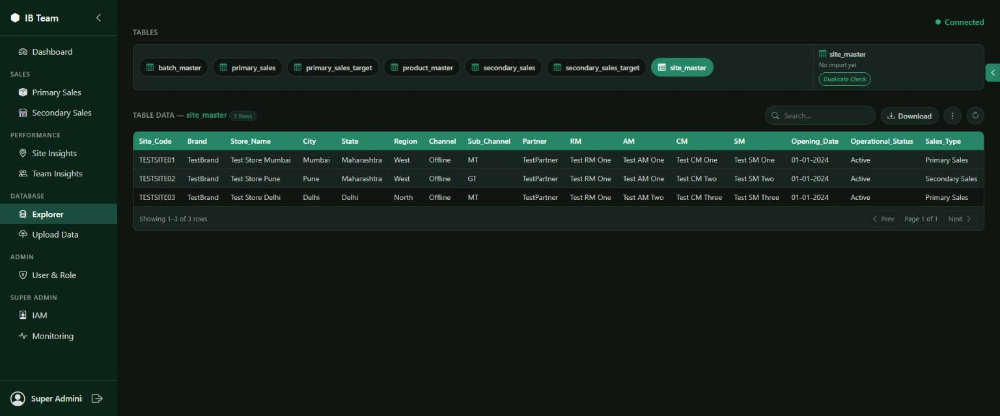
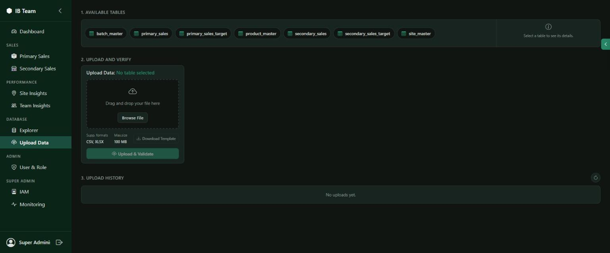
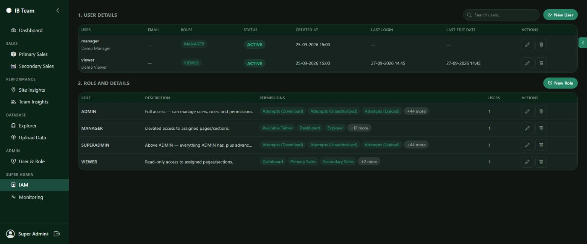

# Sales & Analytics Admin Portal

An internal Spring Boot admin application for teams that need to track retail sales performance
across multiple brands, partners, and channels. It centralizes two parallel sales pipelines —
**Primary Sales** (sell-in to partners/distributors) and **Secondary Sales** (sell-through to end
customers) — alongside the **Site/Store** and **Product master data** both depend on, so targets,
daily trends, and achievement percentages can be reported consistently by brand, region, channel,
partner, and time period. Everything is brand-agnostic by design: brand, channel, and region are
just filters, so the same portal can onboard additional brands or partners without code changes.

Beyond reporting, it's a self-service data platform for the underlying tables:

- **Data Upload** — a CSV/XLSX import pipeline with a dry-run **Preview** step (runs the real
  import logic inside a transaction that always rolls back, so what you see is exactly what a
  commit would do), chunked commits, duplicate detection, identity-column preservation, per-row
  error reporting, and a retained Upload History (auto-cleaned by a nightly job).
- **Explorer** — a generic browse/search/edit/export UI over every exposed table, with no SQL
  required; a fixed set of internal/system tables (`user_master`, `import_sessions`, audit/log
  tables, etc.) is always hidden from it.
- **Its own login/RBAC system** — session-based auth (BCrypt-hashed passwords), not the full
  Spring Security filter chain, with roles, per-page/section permissions, and per-user feature
  toggles, all managed from the IAM screen.
- **Monitoring** — an audit trail of login, upload, download, and unauthorized-access attempts.

## Screenshots

| Dashboard | Site Insights — Geo Map |
|---|---|
|  |  |

| Explorer | Data Upload |
|---|---|
|  |  |

| IAM / Roles |
|---|
|  |

## Tech stack

- **Backend:** Java 17, Spring Boot 3.2.5 (`spring-boot-starter-web`, `-data-jpa`/Hibernate,
  `-validation`), Maven, Lombok
- **Database:** MySQL 8+ (via `mysql-connector-j`) — see [Database](#database)
- **Auth:** Custom session-based login with BCrypt password hashing (`spring-security-crypto`
  only, *not* the full `spring-boot-starter-security` filter chain — see `pom.xml`'s comment on
  that dependency); its own role/permission/feature-toggle model instead of Spring Security's
- **Frontend:** Static HTML/CSS/vanilla JS under `src/main/resources/static/` (one folder per
  page/component, no build step, no bundler — served directly by Spring Boot); [Apache
  ECharts](https://echarts.apache.org/) for charts, [D3.js](https://d3js.org/) + TopoJSON for the
  Site Insights geo map
- **File import/export:** Apache POI (`poi-ooxml`, XLSX), OpenCSV (CSV)
- **Dev tooling:** Spring Boot DevTools (auto-restart on rebuild)

## Prerequisites

- JDK 17+ (the Maven build targets `--release 17`; a newer JDK on `PATH`/`JAVA_HOME` is fine as
  long as Lombok's `annotationProcessorPaths` entry in `pom.xml` stays in place — some newer
  `javac` versions no longer auto-discover annotation processors from the plain classpath)
- Maven (or just use the bundled `./mvnw` / `mvnw.cmd`)
- MySQL 8+

## Database

The application uses **MySQL**. `database/local-mysql-schema.sql` builds the full schema — apply it once
against a fresh MySQL database. `com.houseofbeauty.util.SqlDialect` holds the MySQL syntax used by the
hand-written SQL (identifier quoting, `LIMIT`, `ON DUPLICATE KEY UPDATE`, etc.).

```sql
CREATE DATABASE houseofbeauty CHARACTER SET utf8mb4;
CREATE USER 'hob_app'@'localhost' IDENTIFIED BY 'change-me';
GRANT ALL PRIVILEGES ON houseofbeauty.* TO 'hob_app'@'localhost';
```

```
mysql -u hob_app -p houseofbeauty < database/local-mysql-schema.sql
```

## Configuration

`src/main/resources/application.properties` holds settings shared by every environment (port
`8091`, session timeout, upload size caps, compression). Datasource credentials are **not**
committed — they live in a per-machine, gitignored file:

- `application-dev.properties` — active by default (`spring.profiles.active=dev`)
- `application-local.properties` — alternative local override, also gitignored
- `application-prod.properties` — production overrides (currently just a placeholder)

Create `src/main/resources/application-dev.properties` pointing at your own database, e.g. for
MySQL:

```properties
spring.datasource.url=jdbc:mysql://127.0.0.1:3306/houseofbeauty?useSSL=false&allowPublicKeyRetrieval=true&serverTimezone=UTC
spring.datasource.username=hob_app
spring.datasource.password=change-me
spring.datasource.driver-class-name=com.mysql.cj.jdbc.Driver
```

## Running

```
./mvnw spring-boot:run
```

The app starts on **http://localhost:8091**. On first run against an empty database,
`AuthBootstrapSeeder` and `FeatureBootstrapSeeder` seed the default roles (`ADMIN`, `MANAGER`,
`VIEWER`, `SUPERADMIN`), the full permission/feature catalog, and one dev-only login per role:

| Username     | Password         | Role       |
|--------------|------------------|------------|
| `admin`      | `Admin@12345`    | ADMIN      |
| `manager`    | `Manager@12345`  | MANAGER    |
| `viewer`     | `Viewer@12345`   | VIEWER     |
| `superadmin` | `SuperAdmin@12345` | SUPERADMIN |

**Change these (or remove the seeder) before any real or shared use.**

## Pages

- **Dashboard** — cross-brand sales overview: monthly target vs. achievement for Primary and
  Secondary Sales side by side, daily sales trends, partner performance, and a product snapshot,
  all filterable by sales type, brand, channel, status, and financial year
- **Primary Sales / Secondary Sales** — the same overview/trends/product-snapshot reporting,
  scoped to just that sales pipeline, plus dedicated report views
- **Site Insights** — look up a site by code or store name; an interactive **Geo Map** (D3 +
  TopoJSON, drill down from all-India to state to district) showing which states/districts have
  sites; a **Compare** view for states, sites, or hand-picked stores; and per-site detail
- **Team Insights** — team- and person-level performance reports (RM/AM/CM/SM hierarchy)
- **Explorer** — generic browse/search/edit/export over every exposed table (`primary_sales`,
  `secondary_sales`, `site_master`, `product_master`, targets, `batch_master`, …)
- **Data Upload** — CSV/XLSX import against any of those tables, with a template download, a
  dry-run preview/validation step, and upload history
- **IAM / Roles** — manage users and roles, and see/edit each role's full permission set (page
  access, section access, upload/download/explorer rights, …) in one place
- **Monitoring** — audit trail of logins, uploads, downloads, and unauthorized-access attempts
- **Super Admin** — reserved top-level console, gated to the `SUPERADMIN` role (currently a shell
  page; no dedicated backend yet)

## Project structure

```
src/main/java/com/houseofbeauty/
├── controller/    REST controllers, grouped by page/feature
├── service/       business logic (one package per page/feature)
├── model/         JPA entities
├── repository/    Spring Data JPA repositories
├── dto/           request/response records
├── config/        Spring configuration (filters, executors, etc.)
├── security/      permission annotations/interceptors
└── util/          small cross-cutting helpers (e.g. SqlDialect)

src/main/resources/static/   frontend (plain HTML/CSS/JS, one folder per page/component)
database/                    schema DDL, ER diagram
doc/                         architecture, testing, and performance-testing notes
```

See `doc/ARCHITECTURE.md` for the upload/import pipeline and key services, and
`doc/TESTING.md` / `doc/PERFORMANCE_TESTING.md` for test conventions and load-testing notes.

## Testing

```
./mvnw test
```

Tests are Mockito-based unit tests (no in-memory database — the app talks to MySQL
directly) under `src/test/java/com/houseofbeauty/service/`.
